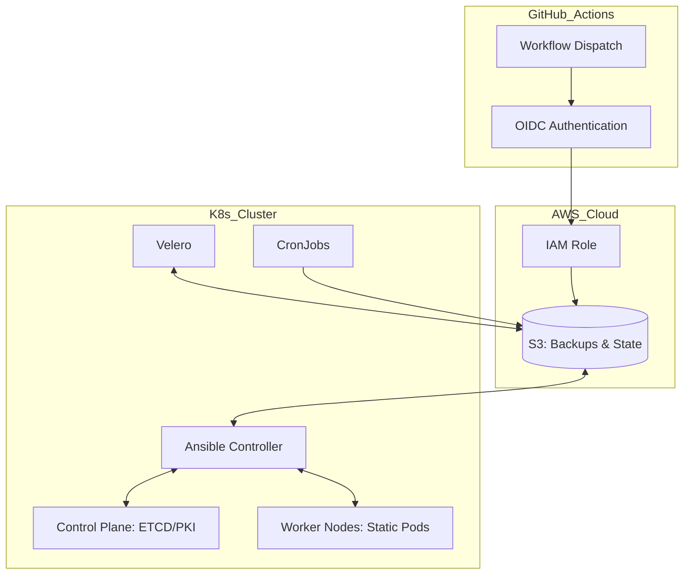
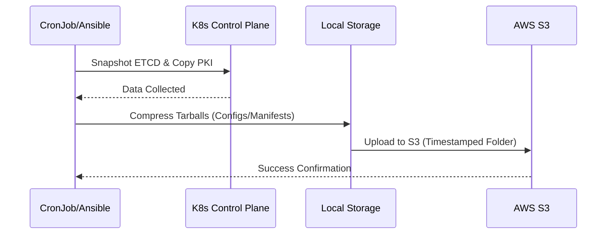
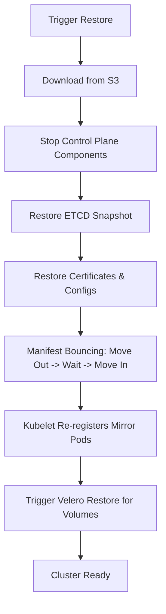

# Kubernetes Disaster Recovery - Full Cluster and Workload Recovery Solution

## Overview
This project provides an enterprise-grade Disaster Recovery (DR) solution for self-managed Kubernetes clusters. It covers two critical recovery layers:
1. **Control Plane Recovery**: Manual and automated backups of ETCD, PKI, and Static Pods using Ansible.
2. **Application Data Recovery**: Backup and restore of persistent volumes and cluster resources using Velero.

The entire infrastructure, including secure GitHub Actions access via OIDC and S3 storage, is managed by Terraform.



## Project Structure
- **ansible/**: Contains playbooks and roles for infrastructure-level backup/restore.
- **terraform/**: Provisions S3 buckets and IAM OIDC roles for secure cloud interaction.
- **kubernetes/**: K8s-native CronJobs for automated control plane backups to S3.
- **backup_velero/**: Ansible role dedicated to triggering and managing Velero backups for stateful applications.

## Prerequisites
- AWS CLI configured with administrative access for initial setup.
- Terraform v1.7+ and Ansible v2.15+.
- Velero CLI installed and configured on the cluster.
- Kubernetes cluster with Master and Worker nodes.

## 1. Infrastructure Setup (Terraform)
The infrastructure layer establishes secure OIDC authentication for GitHub Actions and provisions the S3 backend for all backup data.

```bash
cd terraform
terraform init
terraform apply -var="github_repo=AdhamAyad/k8s-dr-ansible"
```

**Components managed:**
- **S3 Buckets**: Dedicated buckets for Terraform state, Velero backups, and Ansible DR archives.
- **GitHub OIDC Module**: A modular IAM configuration that allows GitHub Actions to assume roles without using static AWS credentials.

## 2. Backup Strategy
The project implements a dual-stream backup approach:



### Control Plane Backup (Ansible)
Captures the essential state of the Kubernetes control plane:
- **ETCD**: Encrypted snapshots of the cluster database.
- **PKI**: Full backup of `/etc/kubernetes/pki` certificates.
- **Configs/Static Pods**: Node-specific manifests and Kubelet configurations.

### Persistent Workload Backup (Velero)
Integrated through the `backup_velero` role to handle:
- Persistent Volume (PV) snapshots.
- Namespaced resources (Deployments, Secrets, PVCs).
- Data is offloaded to the designated S3 bucket.

### Automation
On-cluster automation is handled via Kubernetes CronJobs (`kubernetes/cronJob-s3.yaml`) to ensure periodic synchronization of local data to S3.

## 3. Disaster Recovery and Restoration
The restoration process is designed to recover from a total cluster failure or data corruption.



### Automated Restore (GitHub Actions)
Triggered via Workflow Dispatch. Requires the S3 backup folder name as input.

### Manual Execution
```bash
ansible-playbook -i ansible/inventory ansible/restore-cluster.yaml -e "backup_folder_name=backup_YYYY-MM-DD"
```

**Restoration Logic:**
1. **Download**: Retrieves the specific backup archive from AWS S3.
2. **ETCD Restore**: Restores ETCD state and PKI certificates.
3. **Manifest Bouncing**: A specialized step that cycles static pod manifests to force Kubelet to re-register Mirror Pods with the API Server, preventing Mirror Pod desync.
4. **Velero Restore**: Triggers Velero to restore application-level data and persistent volumes from S3.

## 4. Verification and Health Check
Post-restoration, verify cluster stability using the following:
```bash
# Verify node status
kubectl get nodes

# Verify all control plane components and application pods
kubectl get pods -A

# Verify Velero restore status
velero restore get
```

## Security and Compliance
- **Identity Federation**: Uses OIDC for GitHub Actions to minimize credential exposure.
- **Storage Isolation**: Separate S3 paths for infrastructure state and backup data.
- **Idempotency**: Ansible roles are designed to be run multiple times without causing side effects.
